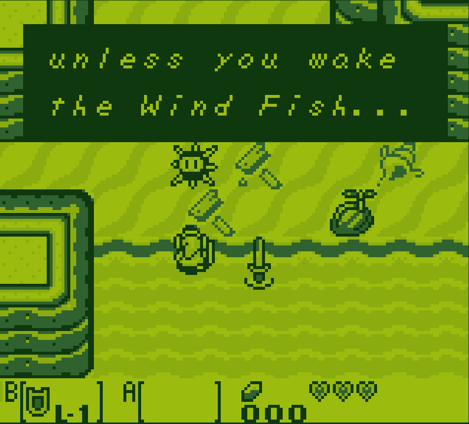

# GB Term |+ ;|

Terminal frontend for the [GBEmu](https://github.com/jgilchrist/gbemu) Gameboy
Emulator, built with [TermOx](https://github.com/a-n-t-h-o-n-y/TermOx).

  

## Build

Relies on cmake to generate build files for the `gb-term` target. git submodules
are used; run `git submodule update --init` after cloning.

## Run

The emulator can run a game by specifying the ROM file as the first argument
when launching from the terminal.

Root privileges are required for proper keyboard input in the terminal, key
release events cannot be accessed without opening the console as a file, which
requires root.

From the build directory:

`sudo ./src/gb-term ~/location/of/ROM/file`

The release build should run fine at 60fps; debug will be slightly slower 🐌

The Gameboy has a resolution of 160x144, if your terminal is not expanded to at
least this size, the display will be scalled to a lower resolution. It is
recommended to make the font size much smaller in order to get the full
resolution(ctrl + (plus/minus) changes font size on most terminals).

Sound is not implemented.

## Controls

### Gameboy

- D-Pad:    __Arrows keys__
- A Button: __z__
- B Button: __x__
- Start:    __Enter__
- Select:   __Backspace__

### Emulator

- __comma__:    Slows emulator speed, bottoms out at normal speed
- __period__:   Speed up emulator, bottoms out at 3x normal speed
- __s-key__:   Save the game cartridge state(must save with game mechanics first)
